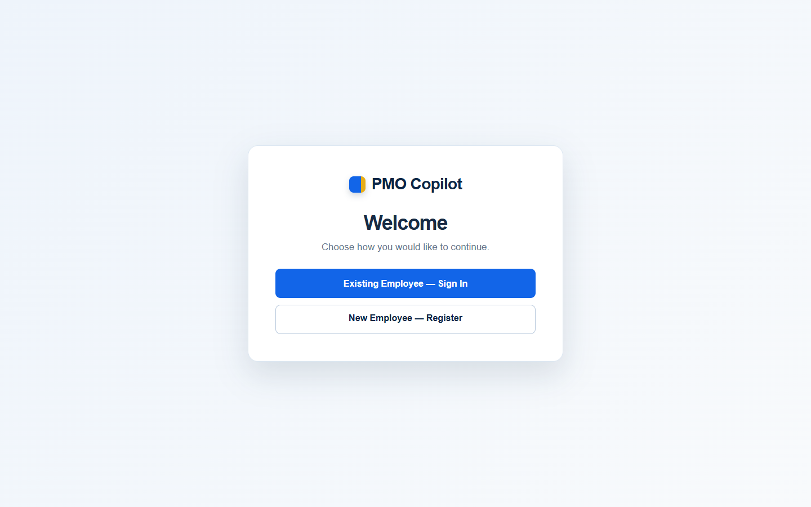
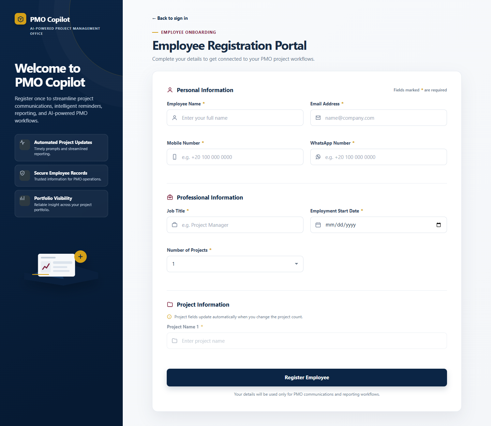
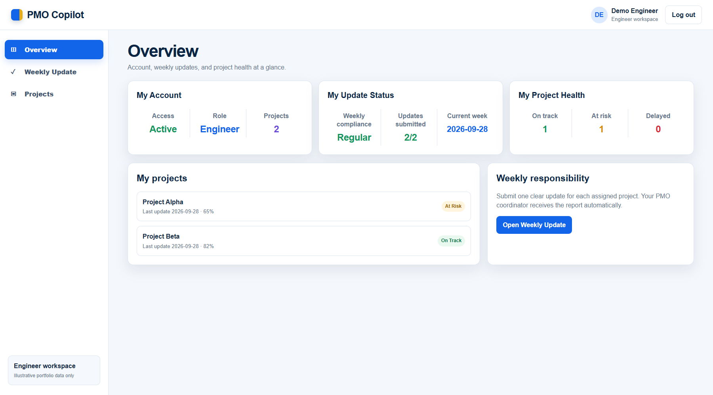
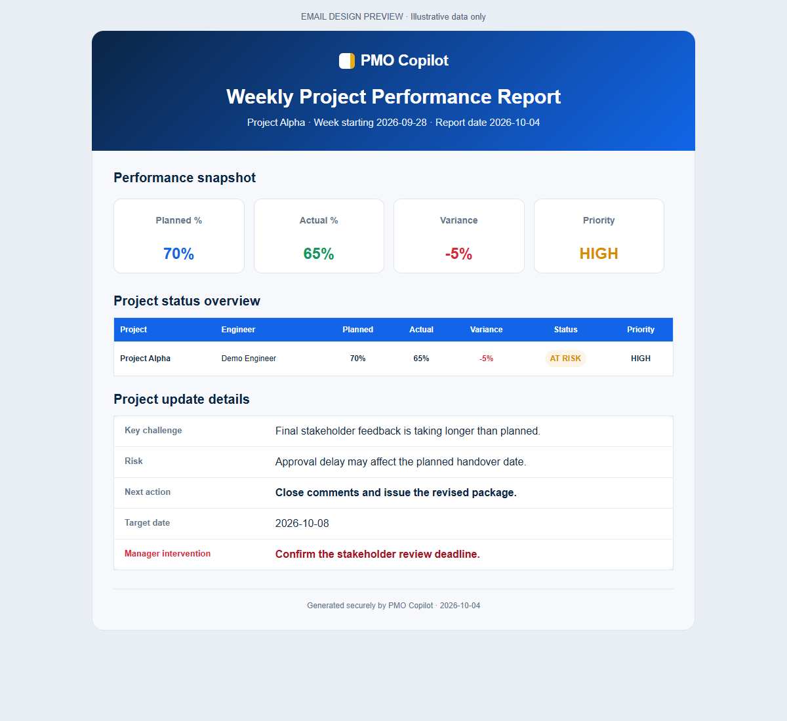
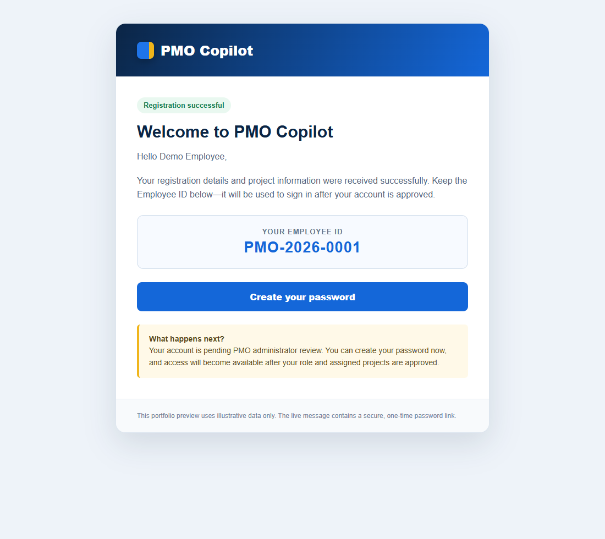
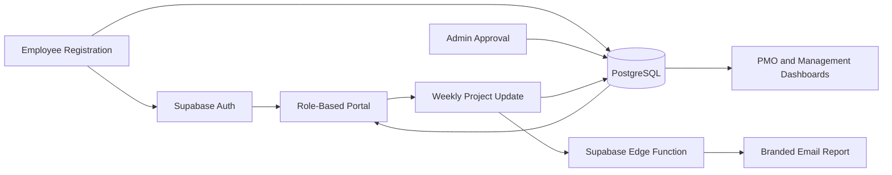

# PMO Copilot

### An AI-assisted platform for structured project updates, portfolio visibility, and smarter PMO operations

PMO Copilot is a working MVP that explores how Project Management Offices can combine structured operational data, workflow automation, secure role-based access, and AI-assisted product development to improve the speed and quality of project reporting.

## Product Preview

### Welcome and access

### Employee onboarding

### Engineer dashboard

### Weekly performance email

### Registration and password email

All screenshots use illustrative data only. No real employee names, email addresses, phone numbers, or project records are shown.

## Why I Built It

The project began with a practical PMO question:

> What if project information were collected correctly at the source instead of being reconstructed manually before every report?

In many organizations, project information is distributed across spreadsheets, emails, messages, and individual follow-ups. Engineers may report progress in different formats, project ownership may not always be clear, and management reports can require considerable manual consolidation.

This creates several business challenges:

- Repeated manual follow-up with project teams
- Inconsistent weekly status information
- Limited visibility into planned versus actual progress
- Difficulty identifying risks early
- Duplicate or disconnected employee and project records
- Time-consuming preparation of management reports
- Limited traceability of approvals and historical changes

PMO Copilot was conceived as a practical response to this problem: a single operational flow connecting employees, projects, weekly updates, risks, approvals, dashboards, and management communication.

## The Product Vision

The long-term vision is not simply to build a registration form or automate an email.

PMO Copilot is intended to become a decision-support layer for the PMO:

- Operational data is entered once in a structured format.
- Project responsibility is clearly assigned.
- Employees see only the information relevant to their work.
- Risks and delays are highlighted early.
- Reports are generated consistently.
- Management receives clearer portfolio visibility.
- AI helps the PMO focus on exceptions that require human judgment.

## From Idea to Working MVP

### 1. Defining the workflow

The first version focused on one-time employee registration. Employee details and assigned projects would later support automated reminders, project update requests, and PMO communications.

The registration experience was designed as a responsive enterprise interface with validation and dynamically generated project fields.

### 2. Testing the automation concept

The first working proof of concept used:

- n8n for workflow automation
- Google Sheets for employee and project records
- Docker for the local n8n environment
- ngrok for temporary webhook access
- Gmail SMTP for registration communication

This phase proved that the end-to-end business process could work and provided valuable experience in workflow logic, webhooks, routing, data transformation, and automated communication.

### 3. Improving the data model

The initial spreadsheet approach revealed an important design issue: employee information and project information should not remain in one repeated flat structure.

The data model was redesigned to separate employees, projects, assignments, and weekly updates while preserving stable Employee IDs and Project IDs. New records receive automatically generated IDs from the database rather than relying on manual numbering.

Historical records were reviewed, cleaned, migrated, and validated before the next phase was built.

### 4. Moving to Supabase

As the concept expanded, the application needed a more reliable backend than a locally running workflow.

The core system was migrated to Supabase:

- PostgreSQL became the system of record.
- Supabase Auth handled user accounts and password creation.
- Row-Level Security controlled access to business data.
- Edge Functions handled registration, login support, administrative actions, and email delivery.
- Database constraints protected project ownership and weekly-update rules.
- Imported employee records can be given secure portal access later without changing their existing Employee IDs, project history, or assignments.

This removed the production dependency on locally running Docker, ngrok, and n8n while retaining the original automation work as a learning and recovery artifact.

### 5. Building the role-based portal

The solution then evolved into a portal for three user roles:

- **Engineer:** views assigned projects and submits weekly updates.
- **Manager:** reviews broader project and portfolio performance.
- **Admin:** approves accounts, assigns roles, confirms projects, manages access, and prepares reports.

Account status, employee availability, and project status were deliberately separated because they represent different business concepts.

### 6. Structuring weekly project updates

Each project update can include:

- Planned progress
- Actual progress
- Automatically calculated variance
- Project status
- Priority
- Key challenge
- Risk
- Next action
- Target date
- Manager-intervention requirements

The system maintains one current official update per project and reporting week while preserving previous versions for traceability.

The reporting week starts on Sunday. The target submission time is Sunday at 10:00 AM Africa/Cairo; submissions remain available until and after 2:00 PM, with updates after 2:00 PM recorded as late rather than blocked.

### 7. Automating project communication

When an engineer submits an update:

- The update is saved in the database.
- The engineer dashboard is refreshed.
- Weekly compliance is recalculated.
- A branded HTML performance report is generated.
- The PMO coordinator receives the report automatically.
- A direct manager can optionally receive it while the PMO coordinator remains copied.

## What the MVP Currently Includes

- Responsive employee registration
- Egyptian mobile-number validation
- Automatic Employee ID and Project ID generation
- Secure password-creation flow
- Employee ID and password sign-in
- Pending account approval
- Engineer, Manager, and Admin roles
- Project assignment management
- One responsible engineer per project
- Engineer-specific project visibility
- Structured weekly updates
- Planned-versus-actual variance
- Risk and intervention tracking
- Weekly submission compliance
- Project-health dashboards
- Branded HTML email reports
- Portfolio reporting foundations
- Audit and communication logs
- CSV and print/PDF reporting options
- Responsive layouts for desktop, tablet, and mobile

## Architecture

## Core Data Foundation

The current model separates:

- Employees
- Projects
- Project assignments
- Weekly project updates
- Employee work status
- Administrative audit events
- Communication delivery records

This separation provides a stronger foundation for future approval stages, job specialties, HR integration, and portfolio analytics.

## Key Product Decisions

- Job title is separate from application access role.
- Creating a password does not automatically activate an account.
- An administrator reviews roles and projects before activation.
- One engineer per project is the starting business rule.
- Project assignments retain history.
- Weekly updates retain previous versions.
- Engineers see only their authorized projects.
- PMO visibility is mandatory for every submitted update.
- HR availability remains a future integration boundary.
- The MVP stays within the Supabase Free Plan.

## Validation Completed

The MVP was tested through a real end-to-end scenario:

- An engineer account was created and approved.
- A project was assigned to the engineer.
- The engineer signed in successfully.
- A structured weekly update was submitted.
- Planned and actual progress were saved correctly.
- Dashboard compliance and project-health indicators changed automatically.
- The project appeared as at risk with the correct progress.
- The branded HTML report was received successfully by email.
- The final source was reviewed for exposed secrets before publication.

## How AI Was Used

ChatGPT and Codex were used as collaborative product-development tools throughout the project for:

- Business-problem exploration
- Requirement refinement
- Workflow design
- UI/UX iteration
- Architecture discussions
- Code generation and revision
- Debugging and testing
- Security and data-quality reviews
- Documentation

The business rules, prioritization, product direction, trade-offs, approvals, and acceptance decisions remained human-led.

This is an intentional part of the project:

> PMO professionals do not need to replace their experience with AI. They can combine domain knowledge with AI to prototype faster, test ideas earlier, improve consistency, and build more capable operational solutions.

## Current Status

The working MVP, Supabase backend, Edge Functions, database migrations, and source code are available in this repository.

The repository includes a GitHub Pages preview backed by Supabase. Before production use, the final public origin and authentication redirect URLs should be verified and restricted to the deployed site.

## Roadmap

Future development may include:

- Production deployment hardening and custom-domain readiness
- Project-manager review and approval
- Top-management reporting and approval
- Role-specific update requirements
- Engineering specialties and job grades
- HR-owned availability integration
- Portfolio trends and historical analytics
- AI-generated management summaries
- Exception detection and recommended actions
- Expanded notification channels
- Production email branding

## What This Project Demonstrates

PMO Copilot demonstrates the intersection of:

- Project Management Office operations
- Business analysis
- Process improvement
- Data modeling
- Workflow automation
- Product thinking
- UI/UX design
- Secure application architecture
- AI-assisted development

It is both a working product prototype and a continuing learning journey toward using AI to transform project-management operations.
